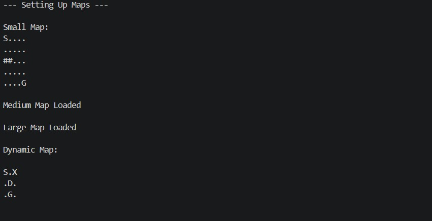
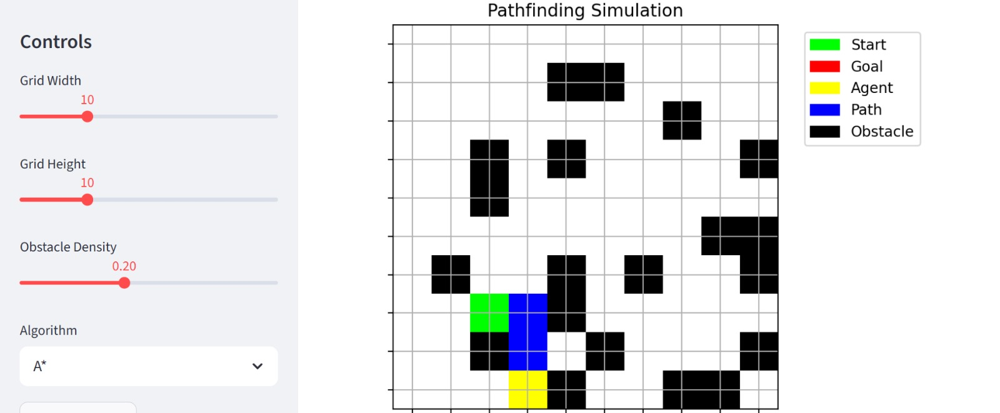
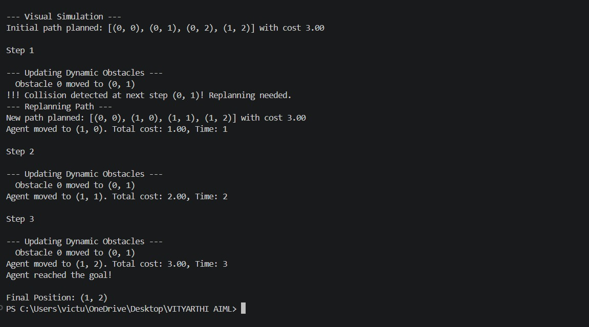
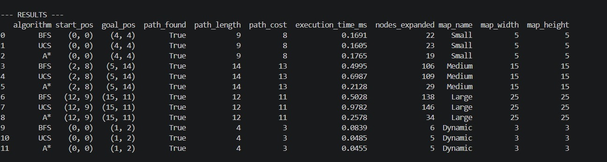
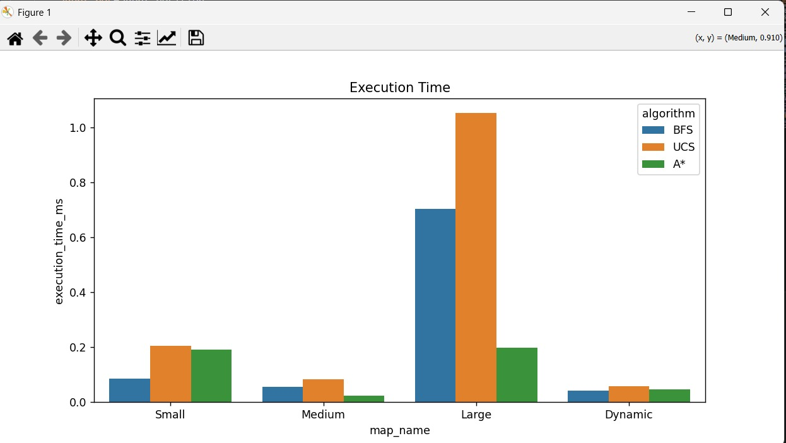
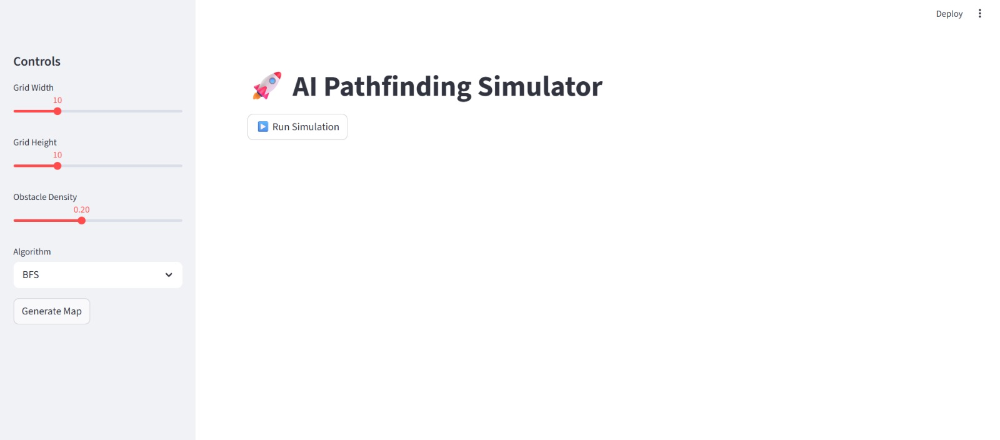

# 🚀 AI Pathfinding Simulator with Dynamic Obstacles

## 📌 Overview
This project implements and visualizes classical AI pathfinding algorithms in a grid-based environment with dynamic obstacles. The system demonstrates how an agent navigates from a start position to a goal while adapting to changes in the environment using real-time replanning.

---

## 🎯 Features

- ✅ Grid-based environment
- ✅ Dynamic obstacle movement
- ✅ Multiple pathfinding algorithms:
  - Breadth-First Search (BFS)
  - Uniform Cost Search (UCS)
  - A* Search
- ✅ Heuristics support:
  - Manhattan Distance
  - Euclidean Distance
  - Chebyshev Distance
- ✅ Real-time path replanning
- ✅ Performance comparison (time, nodes expanded)
- ✅ Interactive visualization (Streamlit UI)
- ✅ Graphical analysis using Matplotlib & Seaborn

---

## 🧠 Algorithms Used

### 🔹 BFS (Breadth-First Search)
- Finds shortest path in unweighted grids
- Explores nodes level by level

### 🔹 UCS (Uniform Cost Search)
- Handles weighted paths
- Expands lowest-cost nodes first

### 🔹 A* Search
- Uses heuristic + cost for optimal and efficient pathfinding
- Most efficient among implemented algorithms

---

## 🎨 Visualization

The project includes:

- 🟩 Start Node  
- 🟥 Goal Node  
- 🟨 Agent Position  
- 🟦 Computed Path  
- ⬛ Obstacles  

The agent moves step-by-step and replans if the path is blocked.

---

## 📊 Experimentation

The system evaluates algorithms on:
- Small, Medium, Large maps
- Dynamic environments

Metrics recorded:
- Execution time
- Nodes expanded
- Path cost

---

## 🖥️ UI (Streamlit)

Interactive controls include:
- Grid size selection
- Obstacle density
- Algorithm selection
- Run simulation

---

## 📁 Project Structure
📦 project-folder
┣ 📜 agent_pathfinding_env.py # Core logic (Grid, Agent, Algorithms)
┣ 📜 main.py # Experiment runner + graphs
┣ 📜 visualizer.py # Matplotlib visualization
┣ 📜 app.py # Streamlit UI
┣ 📜 results.csv # Output data
┗ 📜 README.md

## 🖼️ Output Screenshots

### 🔹 Grid Representation


*Figure: Grid showing start, goal, and obstacles.*

---

### 🔹 Path Visualization


*Figure: Path computed by A* algorithm.*

---

### 🔹 Step-by-Step Simulation


*Figure: Agent moving step-by-step toward goal.*

---

### 🔹 Performance Results Table


*Figure: Comparison of algorithms (time, cost, nodes expanded).*

---

### 🔹 Execution Time Graph


*Figure: Execution time comparison of BFS, UCS, and A*.*

---

### 🔹 Streamlit UI


*Figure: Interactive Streamlit dashboard for simulation.*

## ⚙️ Installation

```bash
pip install numpy pandas matplotlib seaborn streamlit
▶️ How to Run
Run experiments:
python main.py
Run UI:
streamlit run app.py

💡 Applications
🚗 Navigation systems (Google Maps-like routing)
🤖 Robotics path planning
🎮 Game AI
📦 Logistics optimization
🚀 Future Enhancements
Deep Reinforcement Learning (DQN using TensorFlow)
Advanced UI dashboard
Real-time animation improvements
Multi-agent pathfinding
Integration with real-world maps

👨‍💻 Author
MD FARHAN ALI

